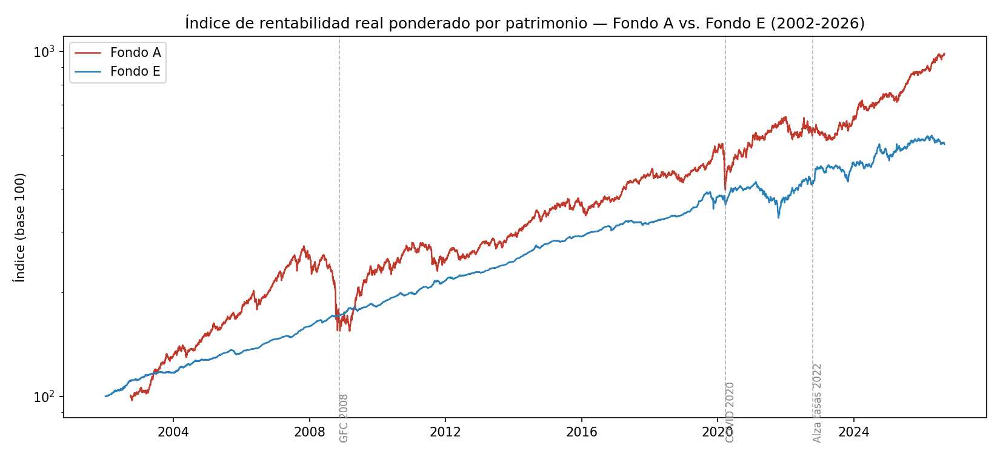
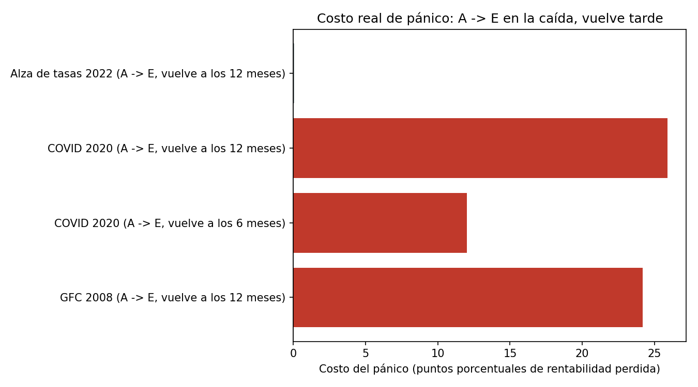
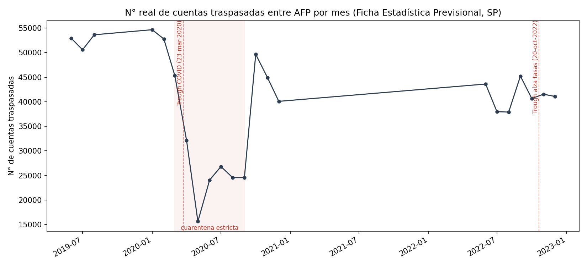

[ 🇺🇸 [Read in English](README.md) ] | [ 🇨🇱 Español ]

[](https://github.com/Rxyxs/chile-pension-fund-switching-cost/actions/workflows/tests.yml)

# chile-pension-fund-switching-cost

¿Cuánto cuesta realmente cambiarse de fondo de pensiones en pánico durante una caída? Este proyecto lo responde con **datos diarios reales** de la Superintendencia de Pensiones (2002-2026, ~278.000 filas), no con un mercado simulado.

**Si no conoces bien el sistema de multifondos**: el ahorro previsional obligatorio de cada trabajador está en uno de 5 "multifondos" (A a E) administrados por una AFP. El Fondo A invierte hasta 80% en acciones — mayor retorno esperado, más vaivenes. El Fondo E invierte casi todo en renta fija — menor retorno esperado, vaivenes mucho más chicos. Los afiliados pueden cambiarse de fondo cuando quieran, y el movimiento típico en una caída es huir de A (o B/C) hacia el "más seguro" E — este proyecto mide si ese instinto realmente compensa.

## Los datos reales — y qué significa "ponderado por patrimonio"

La Superintendencia de Pensiones publica dos números cada día hábil, para cada AFP, para cada uno de los 5 tipos de fondo:

- **`valor cuota`** (precio de la unidad): piensa en cada fondo como dividido en millones de "cuotas" pequeñas. Este es el precio de una cuota ese día. Por sí solo solo te dice el *retorno* del fondo de esa AFP — no puedes comparar el número crudo entre dos AFPs, porque cada una parte su propio precio de cuota en CLP 10.000 cuando el fondo se crea.
- **`valor patrimonio`** (activos totales administrados): cuánta plata, en total, tiene el fondo de esa AFP ese día.

Este dato no está expuesto como una API limpia — es un endpoint `.php` detrás de un formulario en `spensiones.cl/apps/valoresCuotaFondo/` que devuelve un archivo de texto separado por punto y coma. `etl/fetch_valor_cuota.py` reproduce esa consulta en Python puro (sin navegador, sin login — cualquiera puede correrlo).

**Una trampa real de calidad de datos que este proyecto tuvo que resolver**: la fila de encabezado (qué AFP está en qué columna) *cambia* cada vez que una AFP entra, sale o se fusiona con otra — 31 veces solo en el archivo del Fondo C, reflejando eventos reales como la consolidación de las AFPs bajo Provida, el lanzamiento de AFP Modelo en 2010, y el de AFP Uno en 2019. Si lees este archivo con un solo encabezado fijo (la primera aproximación obvia), todo después del primer cambio se desplaza silenciosamente — terminarías atribuyéndole los números de una AFP al nombre de otra, sin darte cuenta. `etl/parse_valor_cuota.py` relee el encabezado cada vez que se repite y reancla desde ahí qué columna pertenece a qué AFP — exactamente este escenario es lo que `tests/test_parse_valor_cuota.py` verifica con un archivo sintético pequeño construido para cambiar de encabezado a mitad de camino.

**¿Por qué "ponderado por patrimonio"?** Como el `valor cuota` de cada AFP es una serie independiente, no puedes simplemente promediar los precios crudos entre AFPs para obtener "el retorno del Fondo A" — promediar precios de series que partieron en distintos momentos y crecieron por separado da un número sin sentido. Lo que sí puedes hacer es: calcular el retorno porcentual diario propio de cada AFP, y luego promediar esos retornos entre AFPs, ponderando cada uno por cuánta plata (`valor patrimonio`) manejaba realmente el día anterior. Esa ponderación importa — imagina que la AFP X (que administra CLP 9 mil millones) tiene un retorno de -10% un día, y la AFP Y, chica (CLP 1 mil millones), tiene +10% ese mismo día; un promedio simple de los dos retornos diría "0%", pero eso no es lo que realmente le pasó a la plata del sistema — el 90% de los pesos en el sistema perdió 10% ese día. `etl/build_duckdb.py` hace esta ponderación, y luego compone los retornos diarios resultantes en un índice por tipo de fondo (partiendo en 100), que es la forma estándar en que los proveedores de índices (como los detrás del IPSA o el S&P 500) construyen un benchmark a partir de muchos componentes.

## Verificación del índice contra la historia conocida

Antes de confiar en un número que yo mismo calculé, lo verifiqué contra dos caídas que cualquiera en el sistema de pensiones chileno recuerda haber vivido:

| Evento | Caída Fondo A | Caída Fondo E |
|---|---|---|
| Crisis financiera 2008 (peak a valle nov. 2008) | **-30,8%** | +0,4% |
| Crash COVID (20-feb a 23-mar 2020) | **-24,6%** | -3,7% |

("Caída" o *drawdown* acá solo significa: cuánto bajó el índice desde su punto más alto hasta su punto más bajo durante esa crisis, en porcentaje.) Ambos números coinciden con la magnitud de esas caídas tal como se reportó públicamente en su momento. Que el Fondo A (hasta 80% acciones) haya caído ~25-30% mientras el Fondo E (mayormente renta fija) casi no se movió no es coincidencia — es exactamente la diferencia de perfil de riesgo que el sistema de multifondos fue diseñado para producir, y ver que los datos la reproducen de forma independiente es lo que me dice que la lógica de construcción del índice de arriba está efectivamente correcta, no solo que se ve razonable.



Escala logarítmica, índice ponderado por patrimonio, base 100 en la fecha más temprana disponible de cada fondo. Los Fondos C y E tienen datos desde 2002-01-02 (el linaje del fondo único pre-reforma); A, B y D parten el 2002-09-28, cuando la reforma de multifondos de 2002 efectivamente dividió el sistema en cinco fondos. Las tres líneas punteadas marcan las ventanas de crisis analizadas abajo — 2008 y 2020 se ven como caídas bruscas y visibles en el Fondo A que el Fondo E apenas registra; 2022 es un desgaste más lento que ambos fondos sienten.

**Versión interactiva**: los `outputs/figures/*.png` de arriba son estáticos; correr `python scripts/make_interactive_dashboard.py` genera `outputs/interactive/pension_switching_dashboard.html` — ábrelo en cualquier navegador para hacer zoom a una caída específica, pasar el mouse sobre cualquier día y ver su valor exacto de índice, y pasar el mouse sobre cada barra de costo de pánico abajo para ver los números de "se queda" vs. "pánico" detrás. No está commiteado (está en `.gitignore`) porque el JSON con ~9.000 días × 2 fondos hace el archivo grande; regenerarlo localmente toma segundos una vez que corriste el pipeline de abajo.

## El contrafactual de cambio en pánico

Un "contrafactual" acá solo significa: tomo dos decisiones distintas que un afiliado pudo haber tomado en los *mismos* días reales, usando los *mismos* valores reales del índice, y comparo dónde termina cada una. Nada del mercado está simulado o supuesto — solo las dos decisiones son hipotéticas.

- **SE QUEDA**: el dinero se queda en el Fondo A toda la ventana — la base de "no hacer nada".
- **PÁNICO**: el dinero se mueve de A a E en el valle de la caída (el punto más bajo) — no en la primera señal de problema, porque no es ahí cuando la gente realmente reacciona. El cambio real se dispara *después* de que la caída ya se sintió y dolió, cuando la cartola muestra la pérdida, lo que está más cerca del valle que del peak. El dinero vuelve a A recién `N` meses después, cuando la recuperación ya ocurrió en gran parte sin él.

| Escenario | Se queda en A | Cambio en pánico (A→E→A) | Costo del pánico |
|---|---|---|---|
| GFC 2008, vuelve a los 12 meses | -4,5% | -28,7% | **24,2 pts** |
| COVID 2020, vuelve a los 6 meses | +20,3% | +8,3% | **12,0 pts** |
| COVID 2020, vuelve a los 12 meses | +32,2% | +6,3% | **25,9 pts** |
| Alza de tasas 2022, vuelve a los 12 meses | +5,6% | +5,5% | **0,1 pts** |

(El "costo del pánico", en puntos, es simplemente el porcentaje de SE QUEDA menos el de PÁNICO — p. ej. en la primera fila, quedarse perdió 4,5%, pero el pánico perdió 28,7%, una brecha de **24,2 puntos porcentuales** entre las dos decisiones en los mismos 2 años.)



**Hallazgo honesto, no elegido a dedo**: el escenario 2022 muestra un costo casi nulo, y quiero ser directo en que esto no se filtró para que la historia se viera más limpia — es la misma metodología aplicada a un cuarto período real, y resulta que contradice a los otros tres. La razón, en simple: la crisis de 2022 fue un reajuste lento y sostenido impulsado por el alza de tasas y la inflación, no una caída-y-rebote brusca. Los bonos (lo que el Fondo E tiene mayoritariamente) *también* se vendieron ese año porque el alza de tasas también les pega a los bonos — así que huir a E no esquivó mucho dolor, y como el Fondo A nunca protagonizó una recuperación brusca en V después, tampoco hubo un rebote perdido que pagar. La conclusión no es "cambiarse en pánico siempre cuesta ~25 puntos" — es que el costo es específico a cierta *forma* de crisis (una caída brusca seguida de una recuperación brusca), que es exactamente lo que fueron 2008 y COVID, y lo que 2022 no fue.

## ¿El comportamiento real de cambio se dispara cerca del valle?

Todo lo anterior responde "cuánto costaría si alguien se cambiara en pánico" — es un contrafactual solo de precios, no evidencia de que la gente realmente lo hace. Así que fui a buscar el comportamiento real: la Superintendencia de Pensiones publica un boletín mensual (`Ficha Estadística Previsional`, un PDF por mes, 164 números archivados desde dic. 2012) que reporta, con 2 meses de rezago, el número real de cuentas traspasadas entre AFP a nivel de todo el sistema ese mes. Descargué 22 de estos boletines — cubriendo una línea base pre-COVID (mediados de 2019), la ventana completa de COVID (2020) y la ventana de alza de tasas 2022 — y extraje ese número real de cada uno.

**Una segunda trampa real de calidad de datos, esta vez en los propios PDF fuente**: la tabla (`Tabla N° 7`) que reporta este número tiene una nota al pie escrita en prosa — *"...traspasadas entre AFP en agosto de 2020 fue de..."* — y en al menos dos de los 22 boletines revisados, esa prosa nombra el mes equivocado (un mes de diferencia en un caso, un año en otro) respecto a lo que dicen los propios encabezados de columna de la tabla. `etl/parse_traspasos.py` no confía en la prosa de la nota al pie para el mes — deriva el mes del encabezado de la tabla (corroborado por todas las demás columnas de esa misma tabla), y solo toma el número de traspasos de la nota al pie. `tests/test_parse_traspasos.py` fija este error exacto con un fixture sintético que lo reproduce.



**Esta es la sorpresa honesta de todo el proyecto**: el volumen de traspasos *no* se dispara en el valle de COVID — *colapsa*, de ~53.000 cuentas/mes a comienzos de 2020 a solo 15.618 en mayo de 2020, para luego rebotar bruscamente a ~50.000 en octubre de 2020. Eso no es evidencia de que la gente no estuviera en pánico — Chile estuvo en cuarentena estricta desde fines de marzo de 2020, las visitas a sucursales de AFP estaban restringidas, y parte del proceso de traspaso todavía no era completamente digital en ese momento, así que el colapso está confundido con la imposibilidad literal de la gente de procesar un cambio, no con que no quisieran hacerlo. El rebote de octubre de 2020 coincide con la flexibilización de la cuarentena y con la controversia política por la primera ley de retiro de fondos previsionales (aprobada en julio de 2020), que puso a las AFP en la contingencia diaria — plausiblemente un gatillo conductual más grande que la propia caída de marzo. La ventana de 2022, en cambio, no muestra ningún movimiento dramático cerca del valle de octubre — consistente con el costo de pánico de ~0 puntos encontrado para ese escenario más arriba: si cambiarse apenas habría costado algo, hay poca razón para esperar un salto en los cambios tampoco.

En resumen: la historia del lado de los precios (cambiarse en pánico en una caída brusca en V es caro) se sostiene bien. La historia del lado del comportamiento (la gente corre a la seguridad justo en el valle) no se sostiene limpiamente en estos datos — el patrón real en 2020 se parece más a "no podía moverse, y se movió una vez que todo reabrió" que a "entró en pánico en el fondo".

## Reproducirlo

```bash
pip install -r requirements.txt
python etl/fetch_valor_cuota.py               # descarga los 5 archivos fuente reales (~7MB)
python etl/parse_valor_cuota.py               # -> data/processed/valor_cuota_long.parquet
python etl/fetch_fichas.py                    # descarga 22 boletines mensuales reales (PDF)
python etl/parse_traspasos.py                 # -> data/processed/traspasos_monthly.parquet
python etl/build_duckdb.py                    # -> data/pension_funds.duckdb
python analysis/panic_switch_cost.py          # -> reports/panic_switch_results.csv
python scripts/make_charts.py                 # -> outputs/figures/*.png
python scripts/make_interactive_dashboard.py  # -> outputs/interactive/*.html (no commiteado, ver arriba)
pytest tests/ -v                              # 13 tests, sin necesidad de red (fixtures sintéticas)
```

## Próximos pasos

La ventana de 22 boletines cubre COVID y 2022 pero no la GFC de 2008 (la serie de boletines solo empieza en dic. 2012) — el hallazgo del lado de los precios sobre la GFC arriba no tiene una contraparte de comportamiento con la cual verificarse. Un seguimiento lógico: extender la serie de volumen de traspasos más atrás, y desagregarla por fondo de origen/destino (`Tabla N° 5`, todavía no extraída) para ver si la plata que sí se movió en 2020 fue hacia donde la historia del pánico predeciría — hacia el Fondo E — o hacia otro lado completamente distinto.

## Autor

Pablo Reyes — Data Scientist, Santiago, Chile.

Licencia: MIT — ver [LICENSE](LICENSE).
