[ 🇺🇸 English ] | [ 🇨🇱 [Leer en Español](README.es.md) ]

[](https://github.com/Rxyxs/chile-pension-fund-switching-cost/actions/workflows/tests.yml)

# chile-pension-fund-switching-cost

What does it actually cost a Chilean saver to panic-switch pension funds during a crash? This project answers that with **real daily data** from the Superintendencia de Pensiones (2002-2026, ~278,000 rows), not a simulated market.

**If you're new to the Chilean pension system**: every worker's mandatory retirement savings sit in one of 5 "multifondos" (funds A through E) managed by a pension fund administrator (an AFP). Fondo A invests up to 80% in stocks — higher expected return, bigger swings. Fondo E invests almost entirely in bonds — lower expected return, much smaller swings. Savers are allowed to switch funds whenever they want, and the popular move during a crash is to flee from A (or B/C) into the "safer" E — this project measures whether that instinct actually pays off.

## What I found

| | |
|---|---|
| **Switching at the bottom destroys value on every indicator** | Across 2,000 synthetic histories it takes 1.92 pp off the real annual return (90% CI: −3.99 to −0.18), lowers the Sharpe ratio by 0.14 and does not reduce the maximum drawdown. At age 50 it cuts the replacement rate by 8.2 to 10.3 points: CLP 100,000 to 127,000 of pension a month, for good. |
| **Switching early doesn't destroy value, but doesn't add any either** | The rule of switching when the loss crosses −15% leaves the expected return unchanged (ΔCAGR −0.12 pp/yr, 90% CI −2.37 to +2.21), lowers volatility in every history and the maximum drawdown in 70%. But against a static mix with the same average exposure to Fondo E, its edge is zero (ΔSharpe +0.00). It isn't timing: it's holding less equity. |
| **Real history was a lucky draw** | From 2006 to 2026 the −15% rule returned 5.80% real a year against 4.08% for staying, with a −30.6% maximum drawdown against −48.3%. That result sits at the 90th percentile of the 2,000 simulated histories. |
| **If the fear is the drawdown, the lever is the fund, not the timing** | Fondo C has the best Sharpe ratio of the five for any real risk-free rate between 0% and 2%. And Fondo E is no safe haven in purchasing power: its real maximum drawdown (−24.1%) matches Fondo C's, and it has been underwater for 67 months. |
| **Anticipating crashes doesn't work** | Monthly returns are not predictable (AR(1), p = 0.53). A regime model that "earned" 1.4 to 2.3 pp/yr with parameters that knew the future ties a static 40/60 mix on Sharpe once it is estimated out of sample. |
| **In purchasing power, the story changes** | Deflated by the UF, 2021–23 was a 26% fall, which in pesos was 14.6% and didn't qualify. The 2008 crisis kept Fondo A underwater for 82 months. |

The rest of this document shows how each row was reached, including the mistakes I made along the way and how they are now pinned down by tests.

## Key performance indicators (KPIs)

`analysis/kpis.py` evaluates funds, strategies and pensions with the industry's standard indicators, all in real terms (UF). The Sharpe ratio is reported at three real risk-free rates instead of hiding the assumption in one number, because the ranking of the funds **changes** with the rate; CVaR at 95% is the average loss in the worst 5% of months; annualization uses the ~261 business days a year the series actually has, not a fixed 252.

**Funds, 2002–2026** (daily business-day returns):

| Fund | Real CAGR | Volatility | Sharpe rf 0% | Sharpe rf 1% | Sharpe rf 2% | Sortino | Max drawdown | Months underwater | Calmar | Monthly CVaR 95% | Worst 12 months |
|---|---:|---:|---:|---:|---:|---:|---:|---:|---:|---:|---:|
| A | 5.85% | 10.2% | 0.61 | 0.51 | 0.41 | 0.84 | −48.5% | 82 | 0.12 | 8.0% | −45.1% |
| B | 5.01% | 7.5% | 0.69 | 0.55 | 0.42 | 0.95 | −37.1% | 38 | 0.13 | 6.0% | −34.2% |
| C | 4.24% | 5.3% | **0.81** | **0.62** | **0.43** | **1.14** | −24.3% | 33 | **0.17** | 4.5% | −22.5% |
| D | 3.26% | 4.3% | 0.76 | 0.53 | 0.30 | 1.08 | −22.1% | 67 | 0.15 | 4.0% | −14.7% |
| E | 2.92% | 4.2% | 0.70 | 0.47 | 0.23 | 1.01 | −24.1% | 67 | 0.12 | 3.8% | −16.5% |

At a 0% rate the Sharpe ranking is C > D > E > B > A; at 2%, C > B > A > D > E. The only robust conclusion is that **Fondo C has the best risk-adjusted return** (and since the Sharpe ratio is linear in the rate, it does for any rate between 0% and 2%). Fondo E has the same real maximum drawdown as Fondo C, starting in February 2021 and still not recovered.

**Strategies, real history** (weekly returns; common window from October 2006 to October 2026, from the first week with an out-of-sample regime signal). Each rule is followed by its **fair benchmark**: a static A/E mix with the same average exposure to Fondo E, rebalanced weekly. Comparing a rule that spends 60% of the time in E against "100% in A" mistakes lower exposure for timing.

| Strategy | Real CAGR | Volatility | Sharpe | Max drawdown | Calmar | Time in E | Decisions | Hit rate | Payoff |
|---|---:|---:|---:|---:|---:|---:|---:|---:|---:|
| Stay in A | 4.08% | 12.1% | 0.39 | −48.3% | 0.08 | 0% | — | — | — |
| Always in E | 2.42% | 5.6% | 0.46 | −23.0% | 0.11 | 100% | — | — | — |
| **−15% rule** | **5.80%** | 10.2% | **0.60** | **−30.6%** | **0.19** | 15% | 3 | 67% | 0.86 |
| ↳ static mix 85% A / 15% E | 3.94% | 10.4% | 0.42 | −42.8% | 0.09 | 15% | — | — | — |
| **Out-of-sample regime** | 3.85% | 7.4% | 0.55 | −23.0% | 0.17 | 60% | 12 | 42% | 1.18 |
| ↳ static mix 40% A / 60% E | 3.29% | 6.2% | 0.56 | −23.3% | 0.14 | 60% | — | — | — |
| Trough (hindsight, not executable) | 0.11% | 10.9% | 0.07 | −48.4% | 0.00 | 15% | 3 | 0% | — |

*Hit rate*: decisions in which E outperformed A while the money was out. *Payoff*: average gain when right divided by average loss when wrong; with a payoff below 1, a rule has to be right more than half the time just to break even.

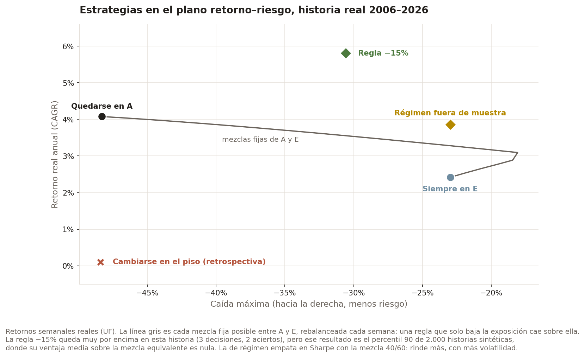

**The rule against staying, over 2,000 histories** (same stationary bootstrap as in the trough section; mean and central 90% interval):

| | −15% rule vs. staying | −15% rule vs. equivalent mix | Trough vs. staying | Trough vs. equivalent mix |
|---|---|---|---|---|
| ΔCAGR (pp/yr) | −0.12 [−2.37, +2.21] | +0.22 [−1.71, +2.33] | −1.92 [−3.99, −0.18] | −1.59 [−3.48, 0.00] |
| ΔSharpe | +0.03 [−0.16, +0.25] | +0.00 [−0.20, +0.23] | −0.14 [−0.30, 0.00] | −0.17 [−0.35, −0.01] |
| ΔMax drawdown (pp; + = smaller) | +6.47 [−7.38, +24.02] | +2.28 [−11.83, +19.90] | −3.52 [−12.73, 0.00] | −7.15 [−17.63, −1.40] |
| Histories where Sharpe improves | 58% | 48% | 2% | 1% |

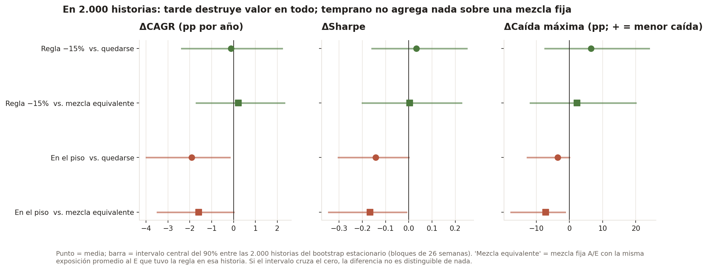

**Pension: replacement rate** (pension divided by the final salary, 29.8 UF). Since the model contributes every month, the level is a ceiling: with a contribution density *d*, the rate is *d* times the one reported. The percentage loss of the pension doesn't change with density if the gaps are spread evenly.

| Crash | Age | Staying | Switching at the trough | Δ | Switching on crossing −15% | Δ |
|---|---:|---:|---:|---:|---:|---:|
| GFC 2008 | 30 | 60.4% | 57.3% | −3.1 pp | 66.6% | +6.2 pp |
| GFC 2008 | 50 | 56.0% | 45.7% | **−10.3 pp** | 80.3% | +24.3 pp |
| COVID 2020 | 30 | 66.1% | 63.1% | −3.0 pp | 63.1% | −3.0 pp |
| COVID 2020 | 50 | 60.8% | 52.2% | **−8.6 pp** | 52.2% | −8.6 pp |
| Inflation 2021–23 | 30 | 67.0% | 64.2% | −2.9 pp | 70.3% | +3.3 pp |
| Inflation 2021–23 | 50 | 61.6% | 53.4% | **−8.2 pp** | 72.8% | +11.2 pp |

**Reading:**

1. **Switching late is the only decision the KPIs condemn unambiguously**: worse CAGR, worse Sharpe and no smaller drawdown, against staying and against an equivalent mix.
2. **Switching early is risk reduction at zero expected cost**, but it adds nothing a static mix with the same exposure doesn't achieve. There is no timing; there is less equity.
3. **The −15% rule's good 2006–2026 result is the 90th percentile** of what the bootstrap considers possible: a favourable history, not a property of the rule. The regime rule returns 0.56 pp/yr more than its 40/60 mix, but with 1.3 pp more volatility: the same Sharpe.
4. **If the concern is the drawdown, the lever is the fund**: Fondo C has the best Sharpe of the five, and a static mix is chosen once and requires guessing nothing.

## The real data — and what "patrimonio-weighted" means

The Superintendencia de Pensiones publishes two numbers every business day, for every AFP, for each of the 5 fund types:

- **`valor cuota`** (unit price): think of each fund as being divided into millions of tiny "shares." This is the price of one share that day. It only tells you the *return* of that AFP's fund — you can't compare the raw number between two AFPs, because each one starts its own share price at CLP 10,000 whenever the fund is created.
- **`valor patrimonio`** (total assets under management): how much money, in total, that AFP's fund holds that day.

This data isn't exposed as a clean API — it's a `.php` export endpoint behind a [Superintendencia form](https://www.spensiones.cl/apps/valoresCuotaFondo/vcfAFP.php) that returns a semicolon-delimited text file. `etl/fetch_valor_cuota.py` reproduces that request in plain Python (no browser, no login needed — anyone can run it).

**A real data-quality trap this project had to solve**: the header row (which AFP sits in which column) *changes* every time an AFP enters, exits, or merges with another — 31 times in Fondo C's file alone, spanning real events like Provida's AFPs consolidating, AFP Modelo's 2010 launch, and AFP Uno's 2019 launch. If you read this file with a single fixed header (the obvious first approach), everything after the first change silently shifts — you'd end up attributing one AFP's numbers to a different AFP's name, and never know it happened. `etl/parse_valor_cuota.py` re-reads the header every time it repeats and re-anchors which column belongs to which AFP from there — this exact scenario is what `tests/test_parse_valor_cuota.py` checks with a small synthetic file built to change its header mid-stream.

**Why "patrimonio-weighted"?** Since each AFP's `valor cuota` is its own independent series, you can't just average the raw prices across AFPs to get "the return of Fondo A" — averaging prices from series that started at different points and grew independently produces a meaningless number. What you *can* do is: compute each AFP's own daily percentage return, then average those returns across AFPs, weighting each one by how much money (`valor patrimonio`) it actually held the day before. That weighting matters — imagine AFP X (managing CLP 9 billion) returns -10% one day, and tiny AFP Y (CLP 1 billion) returns +10% the same day; a simple average of the two returns would say "0%," but that's not what actually happened to the system's money — 90% of the pesos in the system lost 10% that day. `etl/build_duckdb.py` does this weighting, then compounds the resulting daily returns into one index per fund type (starting at 100), which is the standard way index providers (like the ones behind the IPSA or S&P 500) build a benchmark out of many underlying constituents.

## Sanity-checking the index against known history

Before trusting a number I computed, I checked it against two crashes that anyone in the Chilean pension system remembers living through:

| Event | Fondo A drawdown | Fondo E drawdown |
|---|---|---|
| 2008 financial crisis (peak to Nov 2008 trough) | **-30.8%** | +0.4% |
| COVID crash (Feb 20 - Mar 23, 2020) | **-24.6%** | -3.7% |

("Drawdown" here just means: how far did the index fall from its high point to its low point during that crisis, in percent.) Both numbers match the magnitude of those crashes as publicly reported at the time. That Fondo A (up to 80% stocks) dropped ~25-30% while Fondo E (mostly bonds) barely moved isn't a coincidence — it's exactly the risk-profile difference the multifondo system was designed to produce, and seeing the data reproduce it independently is what tells me the index-building logic above is actually correct, not just plausible-looking.

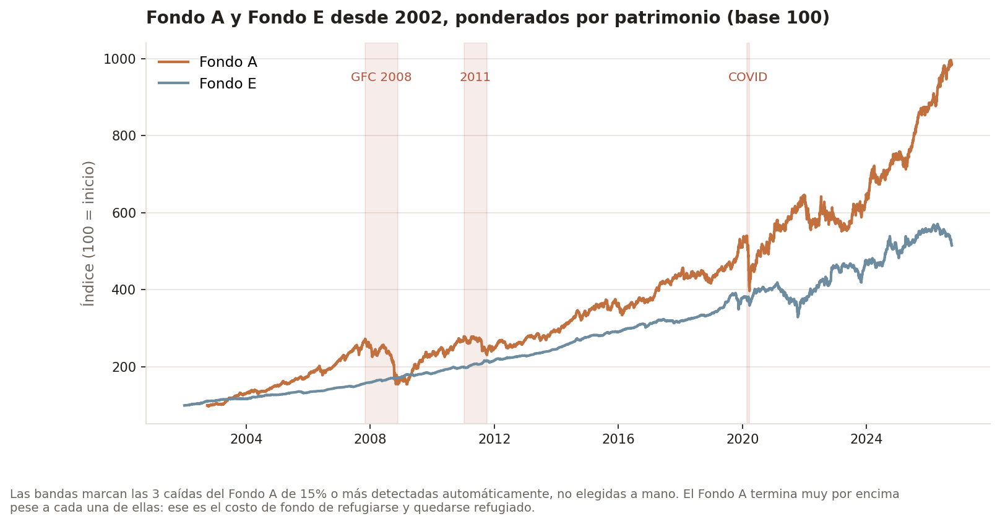

Log scale, patrimonio-weighted index, base 100 at each fund's earliest available date. Fondo C and E have data back to 2002-01-02 (the original pre-reform single-fund lineage); A, B and D start 2002-09-28, when the 2002 multifondo reform actually split the system into five funds. The three dashed lines mark the crisis windows analyzed below — 2008 and 2020 show up as sharp, visible drops in Fondo A that Fondo E barely registers; 2022 is a slower grind that both funds feel.

**Interactive version**: `outputs/figures/*.png` above are static; running `python scripts/make_interactive_dashboard.py` builds `outputs/interactive/pension_switching_dashboard.html` — open it in any browser to zoom into a specific crash, hover over any day for its exact index value, and hover over each panic-switch bar below for its underlying "stay" vs. "panic" numbers. It's gitignored (not committed) because the underlying JSON payload for ~9,000 days × 2 funds makes the file large; regenerating it locally takes a few seconds once the pipeline below has run once.

## The panic-switch counterfactual

A "counterfactual" here just means: I take two different decisions a saver could have made on the *same* real days, using the *same* real index values, and compare where each one ends up. Nothing is simulated or assumed about the market — only the two decisions are hypothetical.

- **STAY**: money stays in Fondo A the entire window — the do-nothing baseline.
- **PANIC**: money moves from A to E at the crash's trough (the lowest point) — not at the first sign of trouble, because that's not when people actually react. Real switching spikes *after* the drop is already realized and painful, once account statements show the loss, which is closer to the trough than the peak. The money then moves back to A only `N` months later, once the recovery has largely already happened without it.

| Scenario | Stay in A | Panic-switch (A→E→A) | Cost of panic |
|---|---|---|---|
| GFC 2008, returns after 12mo | -4.5% | -28.7% | **24.2 pts** |
| COVID 2020, returns after 6mo | +20.3% | +8.3% | **12.0 pts** |
| COVID 2020, returns after 12mo | +32.2% | +6.3% | **25.9 pts** |
| 2022 rate-hike shock, returns after 12mo | +5.6% | +5.5% | **0.1 pts** |

("Cost of panic," in points, is just the STAY percentage minus the PANIC percentage — e.g. in the first row, staying lost 4.5%, but panicking lost 28.7%, a **24.2 percentage-point** gap between the two choices over the same 2 years.)

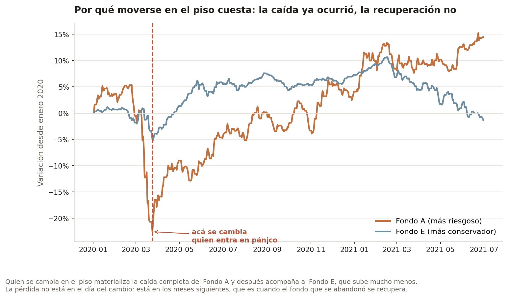

The mechanism, on the 2020 crash. Fund A falls 23% and Fund E barely moves — which is
exactly why fleeing feels right at that moment. The cost is not paid on the day of the
switch: it is paid over the following year, when Fund A climbs back to +15% and Fund E
ends roughly where it started. You materialise the fall and then sit out the recovery.

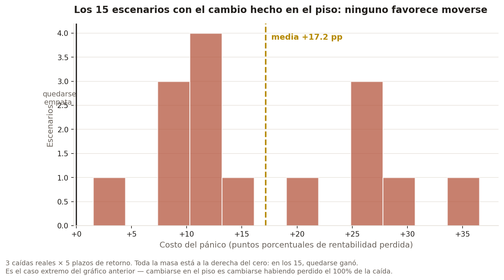

**Honest finding, not cherry-picked**: the 2022 scenario shows almost no cost, and I want to be upfront that this wasn't filtered out to make the story cleaner — it's the same methodology applied to a fourth real period, and it happens to disagree with the other three. Here's why: after the October 2022 trough, Fondo A never staged a V-shaped recovery. Over the following 12 months, A and E returned exactly the same (+3.0% nominal each), so there was no rebound to miss.

**A correction to the first version of this README**, which attributed the result to "bonds also selling off that year because of rate hikes". In Chile that happened in *2021*, not 2022: Fondo E fell 7.3% nominal in 2021, and between the end of 2021 and the 2022 trough it *rose* 10.2%, largely because its bonds are indexed to the UF during that year's inflation. The takeaway isn't "panic-switching always costs ~25 points" — it's that the cost is specific to a certain *shape* of crisis (a sharp fall followed by a sharp recovery), which is exactly what 2008 and COVID were, and what 2022 wasn't.

## Beyond 4 examples: every real crash the data actually contains

The four scenarios above were picked because they're the crises anyone who lived through them remembers by name — and that's a real form of selection bias: a hand-picked list only contains crises someone thought to name, and tends to overrepresent dramatic, well-known ones. `analysis/drawdown_episodes.py` removes the human from that step: it scans the full 2002-2026 Fondo A index programmatically for every period where the index fell at least 15% from a prior peak and later fully recovered, no memory of "famous crashes" required.

It found exactly 3:

| Peak | Trough | Real drawdown | Recovered |
|---|---|---|---|
| 2007-10-31 | 2008-11-21 | -43.2% | 2010-11-05 |
| 2011-01-06 | 2011-10-05 | -17.3% | 2013-01-30 |
| 2020-02-24 | 2020-03-24 | -26.5% | 2020-11-25 |

Notably, the 2022 rate-hike period from the table above is **not** in this list — it never crossed a 15% drawdown by this measure, which is consistent with (not contradicting) the near-zero panic cost already found for it above: a crisis that was never a sharp drawdown in the first place doesn't create much of a "trough" to panic-sell into.

**In real terms, it is.** Deflated by the UF, 2021–23 is a 26% loss of purchasing power. See [In purchasing power, not pesos](#in-purchasing-power-not-pesos).

`analysis/systematic_panic_switch_cost.py` then tests each of these 3 real episodes against a grid of 5 realistic return lags (3/6/12/18/24 months) — 15 scenarios total, not 4 — and reports the distribution instead of individual anecdotes:

```bash
python analysis/systematic_panic_switch_cost.py     # -> reports/systematic_panic_switch_results.csv
```

| | Value |
|---|---|
| Scenarios | 15 (3 real episodes × 5 return lags) |
| Mean cost of panic | **+17.15 pts** |
| Median cost of panic | +12.19 pts |
| Std. dev. | 10.05 pts |
| Range | +1.53 to +36.51 pts |
| Panic worse than staying | **100%** of scenarios |
| Panic better than staying | 0% of scenarios |

Every one of the 15 systematic scenarios favored staying — not just the 3 headline crashes, across every return lag tested. That's a stronger, more mechanically-derived version of the same conclusion the 4 hand-picked scenarios pointed to, not a different one — but now it's backed by every qualifying real crash in the dataset instead of a curated four. Full per-scenario numbers in `reports/systematic_panic_switch_results.csv`; aggregate numbers in `reports/systematic_panic_switch_summary.json`.

**A caveat this result needs, and that the first version of this README didn't have.** All 15 scenarios switch *at the trough*, and the trough is only known afterwards. Picking the realized minimum guarantees by construction that what comes next is a rise. On top of that, only drawdowns that recovered are included: the ones that never come back — exactly the ones where switching would have won — are left out. So this 100% is the worst case with hindsight, not the typical cost of panicking. [The bootstrap below](#the-bottom-is-hindsight-how-much-of-the-result-was-hindsight) measures how much of the result that was.

## "And what if I had moved *earlier*?" — where the advice flips

Everything above fixes the switch **at the trough**, which is what panic means: you flee
after the fall has already happened. But a reasonable reader asks the obvious follow-up —
*what if I had moved when it had only dropped a little?*

`analysis/timing_grid.py` answers it, with one design decision that does the real work.

**The variable is not the calendar, it is the loss already suffered.** Sweeping by "days
before the trough" produces a result that is true and useless: switching a week after the
2007 peak wins by 90 points, because it dodges the entire crash. But nobody knows they are
standing on the peak — that combination measures foresight, not panic. What a person *can*
observe on the day they decide is how much they have lost so far. So the grid is indexed by
drawdown-at-switch, which turns the question into an actionable one: **if I have already
lost X%, does moving still help?**

481 combinations of (switch day × return lag) across the 3 real drawdowns:

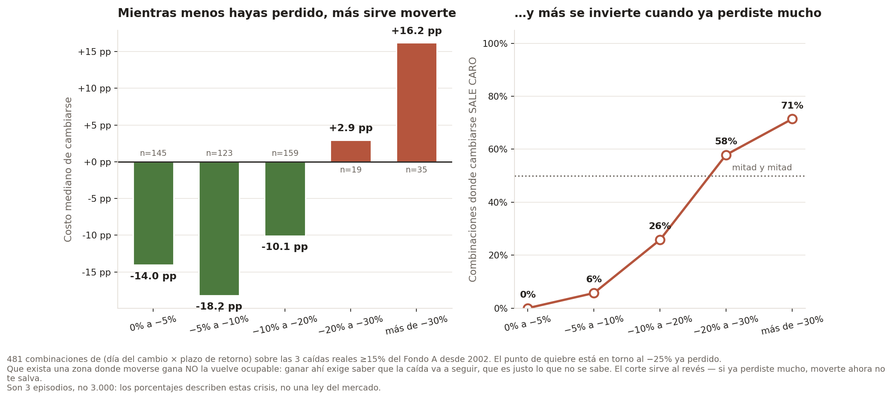

| Loss already suffered when switching | n | Median cost of switching | Switching wins |
|---|---:|---:|---:|
| 0% to −5% | 145 | **−14.0 pp** | 100% |
| −5% to −10% | 123 | **−18.2 pp** | 94% |
| −10% to −20% | 159 | **−10.1 pp** | 74% |
| −20% to −30% | 19 | **+2.9 pp** | 42% |
| more than −30% | 35 | **+16.2 pp** | 29% |

**The break-even sits around −25% of loss already taken.** Below it, moving still helped in
these crashes; past it, it cost — and the original trough-anchored analysis is simply the
extreme case of that last row, since switching at the trough means switching having
absorbed 100% of the fall.

Three caveats, because this result is easy to misread:

- **It is not a strategy.** A region where switching wins is not a region you can occupy:
  winning there requires knowing the fall will continue, which is exactly what is unknown
  at the time. The threshold is useful in the other direction — telling someone who has
  already lost a lot that moving now will not save them.
- **Three episodes, not three thousand.** The percentages describe these crises. The
  −20% to −30% bucket rests on 19 combinations drawn from the same handful of crashes, so
  the 42% there carries far less weight than the 100% in the first row.
- **The buckets are not independent observations.** Combinations within one episode share
  the same market path, so the effective sample is closer to 3 than to 481.

## In purchasing power, not pesos

Everything above uses the valor cuota in current pesos, and that has a consequence the first version of this project missed: every return carries Chilean inflation inside it, around 3.8% a year over the sample. When comparing two funds over the same days that doesn't matter, because inflation cancels out of the ratio. But a pension is paid in purchasing power, and as soon as the analysis mixes returns with salaries or pensions, it has to be deflated.

`etl/fetch_uf.py` downloads the daily UF (*Unidad de Fomento*, Chile's inflation-indexed unit of account) for 2002–2026, from the Banco Central series via the public mirror mindicador.cl, and `etl/build_duckdb.py` builds `fund_index_real`, the same index divided by the UF.

**A third data trap, worse than the other two.** The downloaded UF series has three defects, and a spot check would only have caught one of them:

- **2015-07-11 appears five times.** Identical copies that fit their neighbours: they are collapsed. If two copies of a day ever disagreed, `etl/parse_uf.py` treats it as a conflict and fails.
- **2015-12-12 and 2015-12-31 are missing.** The UF grows at a constant daily geometric rate between the 10th of one month and the 9th of the next, so geometric interpolation reproduces the exact value the formula would have published.
- **The US dollar leaked into the series.** On 2014-12-29 and 12-30 the "UF" is 608.15 and 607.38 — the *dólar observado* (official USD rate) of those days — instead of 24,627.10. Deflating by it made the real index jump ×40 and back. I found it by profiling daily returns before modelling them: a +370% log-return day and an excess kurtosis of 4,300. The guard is structural, not a hardcoded date: the UF cannot move 1% in a day (that would be ~35% monthly inflation; the largest legitimate daily move in the sample is 0.063%, from March 2022's 1.9% CPI).

All three are pinned down in `tests/test_uf.py`.

**Real annual return, Sep-2002 to Oct-2026:**

| Fund | Nominal | Real (UF) |
|---|---:|---:|
| A | 9.99% | **5.88%** |
| B | 9.10% | 5.02% |
| C | 8.22% | 4.24% |
| D | 7.27% | 3.26% |
| E | 6.85% | **2.92%** |

The A > B > C > D > E ordering is monotonic, which is what the system's risk design requires — a good sign the deflation is done right.

**And in real terms, the crashes are different.** The same 15% threshold, applied to the real index:

| Peak | Trough | Real drawdown | Recovered in UF |
|---|---|---:|---|
| 2007-11-02 | 2008-11-21 | −48.3% | **2014-08-22** |
| 2020-02-14 | 2020-03-20 | −25.1% | 2021-01-15 |
| 2021-11-19 | 2023-05-05 | **−25.8%** | 2025-08-08 |

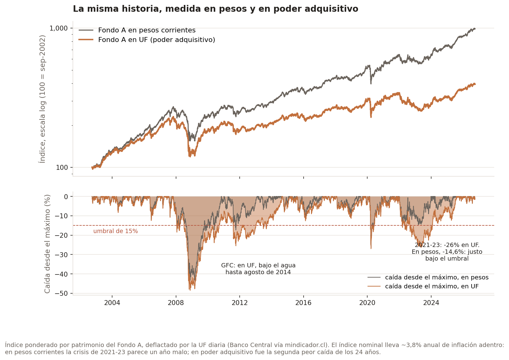

The 2008 crisis kept Fondo A underwater in purchasing power for almost seven years, not three. The 2011 drop disappears as an episode of its own: in UF terms it happened *inside* the GFC hole, which hadn't recovered yet. And 2021–23 appears — a −14.6% drop in pesos that didn't qualify — which, with 2022's 12.8% inflation on top of the market fall, was the second-worst loss of the 24 years in purchasing power. That is the pension loss people actually felt.

## The loss in the pension, not in points

All of the analysis above measures the cost on a single lump sum: how much a peso already inside would have grown. That is an investor's question, not a saver's. `analysis/pension_loss.py` simulates full pension careers and measures the loss where it matters.

**Assumptions, stated upfront:**

- A man contributing 10% of a 20 UF salary (about CLP 820,000) from age 25 to 65, with 1% real annual salary growth.
- **Fondo A until 55, Fondo B from 56.** Law 19.795 bars men from 56 and women from 51 from holding their mandatory balance in Fondo A. A simulation that leaves a 60-year-old in Fondo A describes a saver who cannot exist — and the first version of this module did exactly that.
- Everything in UF. The real index is used where there is data (2002–2026); outside that window, each fund's mean real return. The result barely depends on that stretch, because both decisions share it: scaling the extrapolated return between ×0.5 and ×1.5 moves a 40-year-old's loss only between 9.4% and 10.6%.
- The balance is converted into a pension with a 20-year annuity-certain at 2% real. It is **not** a life annuity: no mortality tables, no beneficiaries. It expresses the loss as pension, it does not estimate anyone's pension. For the same reason the result is the **percentage**, which depends on neither the salary nor contribution gaps; the peso figures are illustrative.

**Change in the pension, for the same person, depending on when they switch** (back to their fund 12 months later):

| Real crash | Age 30, at the trough | Age 50, at the trough | Age 50, on crossing −15% |
|---|---:|---:|---:|
| GFC 2008 | −5.1% | −18.5% | **+43.4%** |
| COVID 2020 | −4.5% | −14.2% | −14.2% |
| Inflation 2021–23 | −4.3% | −13.3% | **+18.2%** |

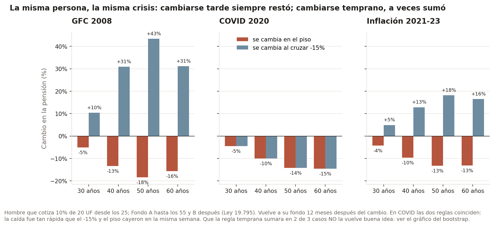

Three things come out of this:

1. **The loss grows with age, and it is permanent.** Once both paths are back in the same fund they grow at the same rate, so the recovery that was missed is never recovered. A young saver dilutes it over decades of later contributions; someone close to retirement has nothing to dilute it with.
2. **My hypothesis about contributions turned out weak.** I expected that no longer "buying cheap" during the crash — contributions going to E while A sits at the bottom — would be a large part of the cost. The module separates that effect from the effect on the balance already accumulated, and it explains between 0% and 14% of the loss: twelve months of contributions weigh little against a balance built over decades.
3. **Switching early would have helped in two of the three crashes.** In the GFC, whoever left on crossing −15% in January 2008 dodged the collapse and came back near the bottom. In COVID both rules coincide: the fall was so fast that −15% and the trough landed in the same week. But three episodes don't make a strategy, and the next section shows why.

**Three mistakes I made building this module, and how they are now pinned down.** The first version mixed a nominal index with a real salary and produced losses of CLP 494,000 a month on a CLP 800,000 salary. It indexed each fund by position from its own first month, and since Fondo A starts in September 2002 and Fondo E in January, E's price was offset by eight months. And it left 60-year-olds in Fondo A. All three have tests in `tests/test_pension_loss.py`, and I verified the offset test by deliberately reintroducing the bug: two tests fail.

## The bottom is hindsight: how much of the result was hindsight

The central result of the project's first version — "in all 15 scenarios, staying won" — has two problems that go beyond there being only 3 crashes:

- **Hindsight.** "Switching at the trough" uses the *realized* minimum of the crash. Nobody knows they are at the bottom; that is known afterwards. And picking the minimum guarantees by construction that a rise comes next.
- **Survivorship.** Only crashes that recovered are included. A crash that never comes back doesn't show up — and those are precisely the ones where switching would have won.

`analysis/bootstrap_cost.py` compares two panic rules:

- **trough**: the project's rule. Switch at the minimum of every 15%+ crash that recovered.
- **observable**: switch the first week the loss from the peak crosses −15%, executed one week later, in *every* crash that crosses it, recovered or not. This is what a person can actually do.

It evaluates them on 2,000 synthetic 24-year histories built with a **stationary bootstrap** (Politis and Romano, 1994) on real weekly A and E returns. It resamples *blocks* of consecutive weeks, not single weeks, to keep what makes a crisis a crisis: volatility clustering and the fall-and-rebound dynamics. Both funds are resampled with the same indices, to keep their correlation. Since block length is the delicate parameter — short blocks break V-shaped recoveries, which are exactly the cost mechanism — results are reported for three lengths:

| Mean block | Rule | Decisions | Median cost | Switching cost money | 90% CI of a history's mean cost |
|---|---|---:|---:|---:|---|
| 13 weeks | trough | 5,158 | +16.4 pp | 95% | [+4.9, +30.1] pp |
| 13 weeks | observable | 5,884 | +3.2 pp | 58% | [−18.4, +17.0] pp |
| 26 weeks | trough | 5,366 | +17.8 pp | 97% | [+6.4, +33.1] pp |
| 26 weeks | observable | 6,041 | +3.4 pp | 59% | [−20.4, +17.7] pp |
| 52 weeks | trough | 5,525 | +21.3 pp | 98% | [+7.6, +35.5] pp |
| 52 weeks | observable | 6,194 | +3.2 pp | 57% | [−26.4, +18.6] pp |

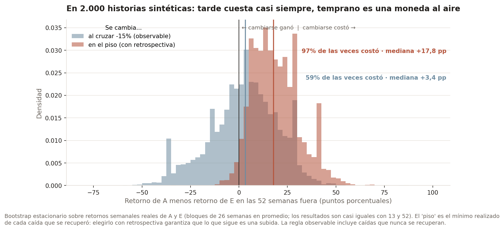

The result doesn't depend on block length. And in real history, the observable rule even won in 2 of 3 cases (GFC: −35.1 pp; 2021–23: −13.3 pp; COVID: +28.2 pp).

The honest reading is no longer "switching always costs" but an **asymmetry**: switching late, near the bottom, is expensive almost always; switching early is a bet with widely dispersed outcomes in both directions. What this doesn't solve: the bootstrap only recombines observed history, so if 2002–2026 doesn't contain a certain type of crisis, no resample will produce it.

## Time series: can a crash be anticipated?

The whole argument rests on "nobody knows whether the fall will continue". Until now that was an argument; `analysis/time_series.py` puts it to a formal test.

**Stationarity.** ADF and KPSS on Fondo A's real index. Both are used because their null hypotheses are opposite:

| Series | ADF (H0: unit root) | KPSS (H0: stationary) | Reading |
|---|---:|---:|---|
| log level | p = 0.355 | p ≤ 0.01 | unit root |
| returns | p < 0.001 | p ≥ 0.10 | stationary |

Returns are modelled, not prices.

**Predictability: does a fall signal more falls?**

| Frequency | n | AR(1) | t (HAC) | p | Ljung-Box |
|---|---:|---:|---:|---:|---|
| daily (business) | 6,263 | +0.218 | +10.13 | < 0.001 | p ≈ 0 (10 lags) |
| **monthly** | 289 | +0.072 | +0.63 | **0.53** | p = 0.34 (12 lags) |

The daily autocorrelation is strong, but it is a known artefact of pension-fund indices: foreign assets are valued with closes from other time zones and illiquid ones with a lag. A saver can't exploit it, because a switch executes days later at the valor cuota of a date they don't know. At the frequency that matches the decision — monthly — **returns are not predictable**. After a month of −5% or worse (10 cases), the 12-month return has a mean of −1.8% but a median of +4.8%, and was positive 60% of the time versus 72% unconditionally. With 10 overlapping months, the difference isn't enough to claim anything.

**Volatility is predictable.** Ljung-Box on squared returns and ARCH-LM: p ≈ 0. A GJR-GARCH(1,1) with Student-t errors gives:

| α | γ (asymmetry) | β | ν | Persistence | Half-life of a shock |
|---:|---:|---:|---:|---:|---:|
| 0.046 | **0.065** (t = 4.9) | 0.897 | 8.4 | 0.976 | **28 business days** |

A significant γ is the leverage effect: falls raise volatility more than rises of the same size. And a half-life of about six weeks means the volatility storm passes long before the 12 months someone typically stays out.

**The trap in this section: weekends.** The first GARCH run gave ν stuck at 2.5 and persistence at exactly 1.0000, identical across four different specifications. A parameter that takes the same value in four models isn't a result — it's the optimizer hitting a bound. The cause: the Superintendencia publishes valor cuota every day, and on Saturdays and Sundays the fund barely moves, accruing only fixed-income interest (43 times less dispersion than a business day). The model saw a fixed weekly pattern it couldn't fit. Daily returns now use business days only, and the Friday-to-Monday return includes the weekend's accrual.

**Regimes.** A two-state Markov-switching model on weekly returns identifies crises from the data, with no hand-picked threshold:

| Regime | Weekly mean | Annual volatility | Expected duration |
|---|---:|---:|---:|
| calm | +0.23% | 8.0% | ~47 weeks |
| turbulent | −0.33% | 20.0% | ~12 weeks |

It dates 14 turbulent episodes, including May 2006, the GFC, the 2010 and 2011 euro crises, Chile's 2019 social unrest, COVID and 2021–22. But **"turbulent" doesn't mean "falling"**: the model detects volatility, not direction, and two of the 14 episodes went up (A +6.0% from August to December 2020).

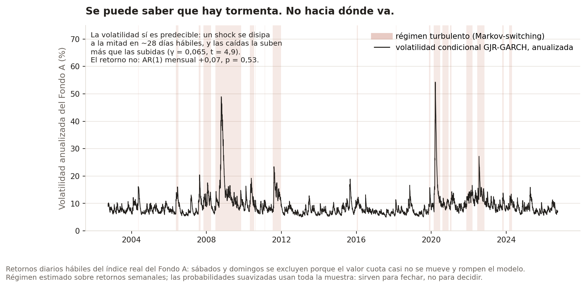

**Can the regime be used to exit in time?** The rule: move to E when the probability of the turbulent regime crosses 0.5, return after 52 weeks, never counting the same episode twice. The first version of this calculation said exiting *won*, and I didn't accept it until it survived two corrections. First, the real execution lag of a switch. Second, out-of-sample estimation: even though filtered probabilities only use the past to filter, their parameters had been estimated on the full sample, future included. The out-of-sample version re-estimates the model every year, using only the data available up to that point.

| Parameters | Execution | Decisions | Switching cost money | Rule returns | Staying in A returns |
|---|---|---:|---:|---:|---:|
| know the future | immediate | 11 | 45% | 6.38%/yr | 4.08%/yr |
| know the future | 1 week later | 11 | 45% | 5.51%/yr | 4.08%/yr |
| out of sample | immediate | 12 | 58% | 4.46%/yr | 4.08%/yr |
| **out of sample** | **1 week later** | 12 | **58%** | **3.85%/yr** | **4.08%/yr** |

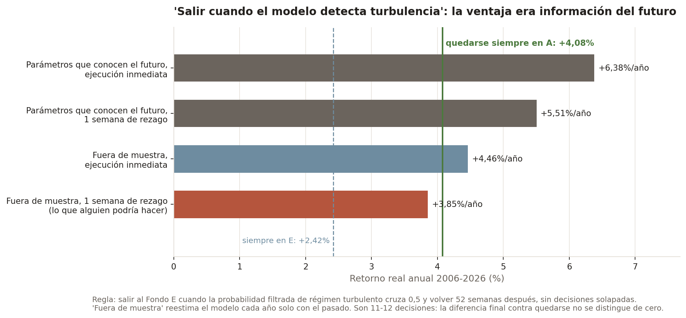

The apparent edge was almost entirely **look-ahead bias**. With 12 decisions, the final difference versus staying can't be distinguished from zero. The right conclusion isn't "the rule loses" but "there is no edge once the information from the future is removed" — which is the formal version of "it isn't a strategy anyone can use".

## Is Fondo E a safe haven?

Against equity crashes, yes. In the 12 turbulent-regime storms in which Fondo A fell, Fondo E protected savers in 10: in the GFC, for instance, A lost 15.6% in real terms between November 2007 and March 2008 while E gained 2.5%. Only in two did both fall (June–November 2022 and March–April 2024).

But Fondo E has its own risk — rates and inflation — and it materializes in other years:

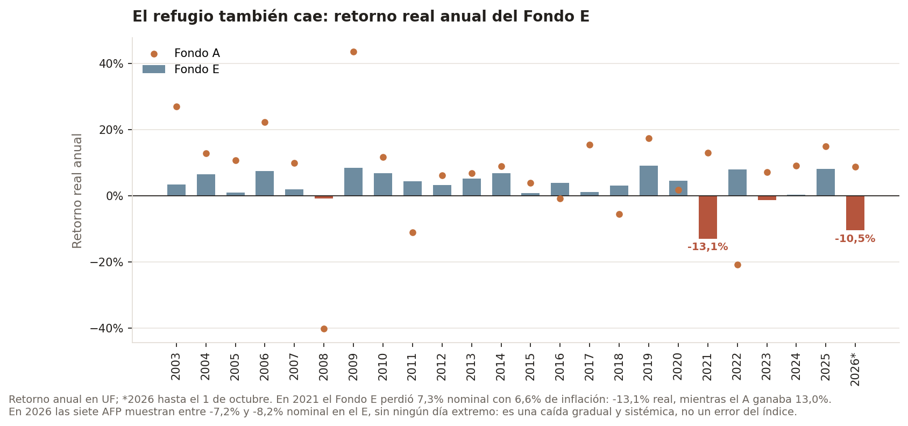

- **2021: −13.1% real** (−7.3% nominal with 6.6% inflation), the same year Fondo A gained 13.0%.
- **2026, through October: −10.5% real** (−7.5% nominal). Before believing it I checked it wasn't an index artefact: all seven AFPs show between −7.2% and −8.2% in Fondo E, with no extreme day. It is a gradual, system-wide fall. I don't know its cause and I don't attribute one.

Switching to Fondo E isn't leaving risk behind. It's trading one risk for another.

## What can be claimed, and what can't

**It can be claimed that:**

- Switching to Fondo E at the bottom of a crash destroys value on every indicator: −1.92 pp of real annual return (90% CI −3.99 to −0.18), a worse Sharpe ratio, and no smaller drawdown. For a 50-year-old saver it removes 8.2 to 10.3 points of replacement rate, permanently.
- Switching early (on crossing −15%) has no expected cost and lowers risk, but no more than a static mix with the same exposure to Fondo E.
- Fondo A's monthly returns are not predictable, and a strategy based on detecting turbulence has no edge once the information from the future is removed.
- Fondo C has the best risk-adjusted return of the five for any real risk-free rate between 0% and 2%.
- Measured in purchasing power, the system had a 26% fall in 2021–23 that the analysis in pesos doesn't register.

**It cannot be claimed that:**

- Switching early is a mistake, or a strategy: in real history it beat staying, but that result is the 90th percentile of what was possible, and on average it is equivalent to a static mix.
- This describes what people actually did. Switching volume in 2020 didn't spike at the bottom (see below), so the "switch at the trough" scenario is a hypothesis about behaviour, not an observation.

## Calculate your own scenario

`scripts/calculator.py` is an interactive command-line calculator: pick one of the real detected drawdown episodes above (or type your own dates), choose which fund you'd panic-switch into and how many months before you'd move back, and it computes the real historical cost against the same data as everything above — not a rule of thumb.

```bash
python scripts/calculator.py
```

## Does real switching behavior actually spike near the trough?

Everything above answers "what would it cost if someone panic-switched" — it's a price-only counterfactual, not evidence that people actually do this. So I went looking for the real behavior: the Superintendencia de Pensiones publishes a monthly bulletin (`Ficha Estadística Previsional`, one PDF per month, 164 issues archived back to Dec 2012) that reports, with a 2-month lag, the real system-wide count of accounts transferred between AFPs that month. I pulled 22 of these bulletins — covering a pre-COVID baseline (mid-2019) plus the full COVID window (2020) and the 2022 rate-hike window — and extracted that one real number from each.

**A second real data-quality trap, in the source PDFs themselves**: the table (`Tabla N° 7`) that reports this number has a footnote written in prose — *"...traspasadas entre AFP en agosto de 2020 fue de..."* — and in at least two of the 22 bulletins checked, that prose names the wrong month (off by a month, in one case off by a year) relative to what the table's own column headers say. `etl/parse_traspasos.py` doesn't trust the footnote's prose for the month — it derives the month from the table's header row instead (which is corroborated by every other column on the same table), and only takes the transfer count itself from the footnote. `tests/test_parse_traspasos.py` locks in this exact bug with a synthetic fixture reproducing it.

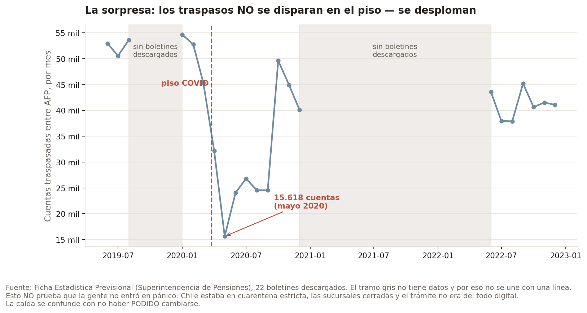

**This is the honest surprise of the whole project**: transfer volume does *not* spike at the COVID trough — it *collapses*, from ~53,000 accounts/month in early 2020 down to just 15,618 in May 2020, before rebounding sharply to ~50,000 in October 2020. That's not evidence people weren't panicking — Chile was under strict lockdown from late March 2020, AFP branch visits were restricted, and part of the transfer process wasn't fully digital yet at the time, so the collapse is confounded with people's literal inability to process a switch, not proof they didn't want to. The October 2020 rebound lines up with lockdown easing and with the political controversy around the first pension-fund withdrawal law (passed July 2020) putting AFPs in the daily news — plausibly a bigger behavioral trigger than the March crash itself. The 2022 window, by contrast, shows no dramatic move around the October trough at all — consistent with the ~0-point panic cost found for that scenario above: if switching barely would have cost anything, there's little reason to expect a spike in switching either.

Net: the price-side story (panic-switching a sharp V-shaped crash is expensive) holds up well. The behavior-side story (people rush into safety exactly at the trough) does not hold up cleanly in this data — the real pattern in 2020 looks more like "couldn't move, then moved once things reopened" than "panicked at the bottom."

## Reproduce it

```bash
pip install -r requirements.txt
python etl/fetch_valor_cuota.py            # downloads the 5 real source files (~7MB)
python etl/parse_valor_cuota.py            # -> data/processed/valor_cuota_long.parquet
python etl/fetch_fichas.py                 # downloads 22 real monthly bulletin PDFs
python etl/parse_traspasos.py              # -> data/processed/traspasos_monthly.parquet
python etl/fetch_uf.py                     # downloads the daily UF 2002-2026 (Banco Central via mindicador.cl)
python etl/parse_uf.py                     # cleans duplicates, gaps and the leaked dollar -> uf_daily.parquet
python etl/build_duckdb.py                 # -> data/pension_funds.duckdb (includes fund_index_real, in UF)
python analysis/panic_switch_cost.py       # -> reports/panic_switch_results.csv
python analysis/systematic_panic_switch_cost.py  # -> reports/systematic_panic_switch_results.csv + summary.json
python analysis/timing_grid.py             # -> reports/timing_grid.csv
python analysis/pension_loss.py            # -> reports/pension_loss.csv (loss in the pension, by age)
python analysis/time_series.py             # -> reports/time_series_summary.json + ts_*.csv (~30 s)
python analysis/bootstrap_cost.py          # -> reports/bootstrap_cost.json (2,000 histories x 3 blocks, ~15 s)
python analysis/kpis.py                    # -> reports/kpis.json + kpis_*.csv (funds, strategies, pension; ~25 s)
python scripts/make_charts.py              # -> outputs/figures/*.png (13 figures)
python scripts/make_interactive_dashboard.py  # -> outputs/interactive/*.html (not committed, see above)
python scripts/calculator.py               # interactive: your own panic-switch scenario
pytest tests/ -v                           # 65 tests, no network needed (synthetic fixtures)
```

## Next steps

- **Women.** The pension model is for a man. For a woman the Fondo A cutoff is at 51 and the legal retirement age is 60: fewer years to dilute a loss, so the cost should be higher at the same age.
- **A real life annuity.** Replace the annuity-certain with one using mortality tables (RV-2020, CB-2014) and each year's prevailing annuity rate.
- **Contribution gaps.** They don't change the percentage lost if they are uniform, but they do if they cluster: someone who loses their job in a crisis stops contributing exactly when units are cheap.
- **The regime, fully out of sample.** The signal strategy is already evaluated out of sample, but the dating of episodes uses the full sample.
- **Behaviour by fund.** The 22-bulletin window covers COVID and 2022 but not the 2008 GFC (the bulletin series starts in Dec 2012). A logical follow-up: extend the transfer series and split it by origin and destination fund (`Tabla N° 5`, not yet extracted) to see whether the money that did move in 2020 went where the panic story predicts — toward Fondo E — or somewhere else.

## Author

Pablo Reyes — Data Scientist, Santiago, Chile.

License: MIT — see [LICENSE](LICENSE).
